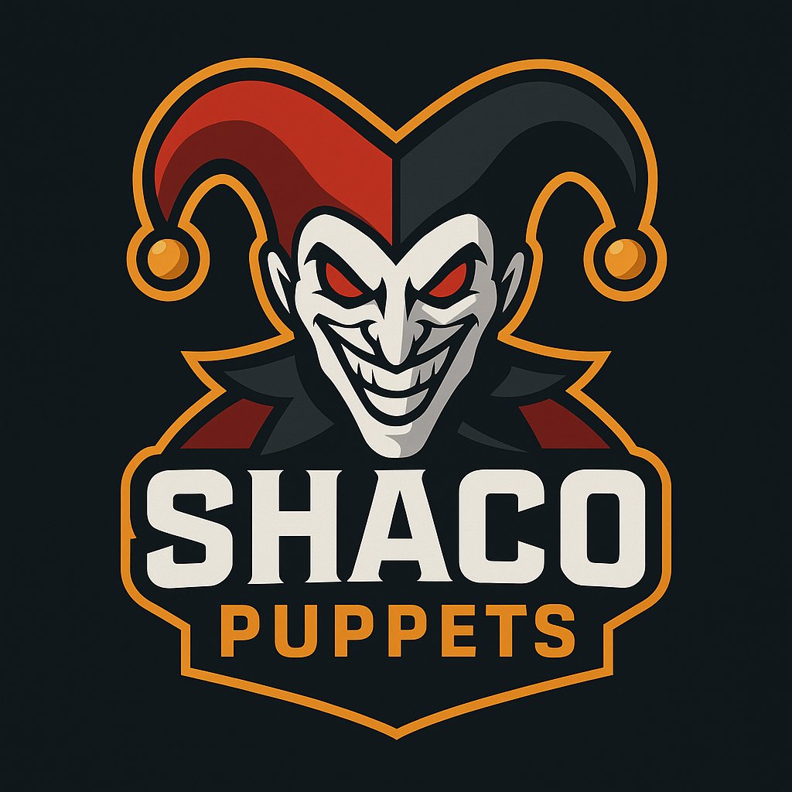

# Shaco Puppets 🃏

  

## About

Shaco Puppets is a modern TypeScript library designed to interact with the Riot Games API, providing seamless integration for League of Legends and future support for Valorant. Built with developer experience in mind, it offers type-safe interactions with Riot's endpoints while maintaining clean, intuitive code.

## Purpose

This library aims to simplify the process of building applications that consume Riot Games API data. Whether you're creating statistics dashboards, match analysis tools, or player lookup services, Shaco Puppets provides the foundation you need with robust TypeScript support and modern JavaScript features.

## Key Features

- **Type-Safe**: Full TypeScript support with comprehensive type definitions
- **Modern**: Built with ES modules and latest JavaScript standards
- **Validated**: Data validation using Zod schemas
- **Developer-Friendly**: Clean API design with intuitive method names
- **Extensible**: Modular architecture for easy extension and customization

## Contributing

We welcome contributions from the community! Whether you're fixing bugs, adding new features, improving documentation, or suggesting enhancements, your input is valuable.

### How to Contribute

- **Report Issues**: Found a bug or have a feature request? Open an issue on our GitHub repository
- **Submit Pull Requests**: Code contributions are always welcome
- **Improve Documentation**: Help make our docs clearer and more comprehensive
- **Share Feedback**: Let us know how we can improve the library

We believe in building this project together with the community. Every contribution, no matter how small, helps make Shaco Puppets better for everyone.

---

**Disclaimer**: Shaco Puppets is not affiliated with Riot Games. League of Legends and Valorant are registered trademarks of Riot Games, Inc.
